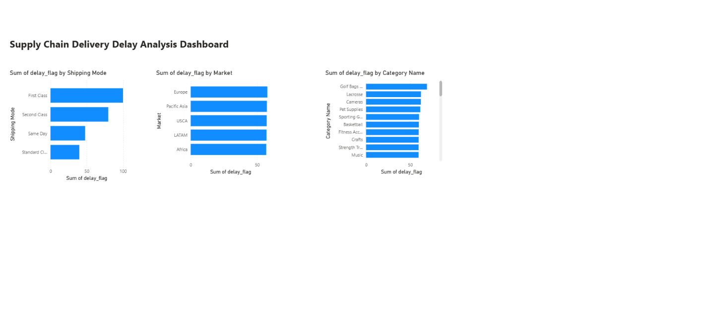

# Supply Chain Delivery Delay Analysis

## Project Overview
Analysis of 180,519 real-world supply chain orders to identify key drivers of delivery delays across shipping modes, regions, and product categories using Python and Power BI.

## Tools Used
- **Python (Pandas)** — data cleaning, analysis, delay flag engineering
- **Power BI** — interactive dashboard with 3 visualizations
- **SQL** — data segmentation and aggregation

## Key Findings
- **Overall delay rate: 57.28%** — more than half of all orders were delayed
- **First Class shipping: 100% delay rate** — every single First Class shipment was late
- **Second Class shipping: 79.73% delay rate** and highest average delay of **2.5 days**
- **Standard Class performed best** at 39.77% delay rate
- **Golf Bags & Carts** had the highest category delay rate at 68.85%
- All regions had similar delay rates (~57%), indicating a systemic issue not tied to geography

## Recommendation
The company is overpromising on premium shipping modes. Realigning shipping SLAs — especially for First Class and Second Class — could significantly improve customer satisfaction and on-time delivery performance.

## Dashboard

## Files
- `supply_chain.py` — Python analysis script
- `delay_by_shipping.csv` — delay rates by shipping mode
- `delay_by_region.csv` — delay rates by market/region
- `delay_by_category.csv` — delay rates by product category
